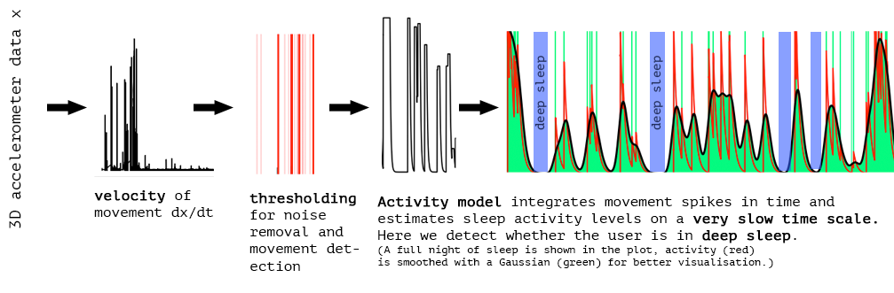

# *accel*: A python-based sleep tracker and acoustic brain stimulator built on a Raspberry Pi 💤🔊🧠〰️

*accel* is an ongoing and unfinished project of building a low-cost sleep tracker and learn a lot on the way. It can track your 💤 sleep during night through an accelerometer and detect how much you are moving. This information is then used to determine whether the user is in the deep sleep (NREM stage II-III) and, if so, trigger the second stage: the acoustic brain stimulation protocol 🔊. This is a low-frequency audible stimulus 〰️ that is then delivered to the 🧠 brain using 🎧 headphones. Why trigger the stimulus in deep sleep? It is known that slow wave activity (~1Hz) in the sleeping human cortex is critical for memory consolidation, the process that writes memory from short-term memory to long-term memory [todo:cite]. 

It has been repeatedly shown [todo:cite] that electrical stimulation of the brain in this sleep stage can enhance memory consolidation in humans. There is also evidence that acoustic stimulation through the auditory cortex can improve memory consolidation as well. 

This project is an experiment to see how far I can approximate the vigorous methods of clinical research with a cheap custom setup that anyone could reproduce. However, it is hard to prove an effect with a subject count of N = 1 at this point. Whether the end goal of enhancing memory consolidation during sleep using an acoustic stimulus can be reached or not, it sure is a fun endeavour! 

## Current build

The hardware and the software is still in development. At this stage, the device consists of these parts:


You can find all of these parts fairly cheap on the internet. After soldering all the parts together, the "assembled" device is pretty compact and also a bit *shaggy*:


## Data processing



## Project roadmap
* [✓] Receive raw movement data from accelerometer
* [✓] Build dynamical model for activity level
* [✓] Save data to local hdf file
* [✓] Save data to remote redis server
* [✓] Plot live movement data to OLED display
* [✗] Design acoustic stimulus 
* [✗] Build a hard case for the tracker
* [✗] Assess deep-sleep detection accuracy using simultaneous sleep EEG
* [✗] Trigger acoustic stimulus in deep sleep
* [?] Use wireless EEG for sleep stage detection *somewhen in the far far future*

## Getting started

First, I want to thank all the people who made all the modules and libraries that I could use to make this project possible. It is amazing what kind of amazing possibilities can lie just one pip install away. The drivers for the accelerometer and the OLED screen are snippets I found online and haven't yet documented where they are from (oops). Thanks also to their authors! 

This project is based on some debian and a python packages. Please make sure that you have installed them. The following commands should work for a fresh install of Raspbian Buster Lite. Make sure you set up ssh correctly and connect to a network ([Google search](https://www.google.com/search?q=raspberry+pi+zero+w+headless+setup)).

#### Enable I2C interface
This is the hardware interface that lets you communicate to connected chips. Enter 

```
sudo raspi-config
``` 

and go to --> `Interfacing` --> `Enable I2C`
#### Install python3 and other binaries
```
sudo apt update -y
sudo apt install build-essential python3-dev python3-pip libatlas-base-dev libhdf5-dev i2c-tools git -y
```
Set python3 as your default python

```
sudo update-alternatives --install /usr/bin/python python /usr/bin/python2.7 1
sudo update-alternatives --install /usr/bin/python python /usr/bin/python3.7 2
sudo ln -s /usr/bin/pip3 /usr/bin/pip

```
#### Install python packages

```
pip install matplotlib numpy smbus h5py redis adafruit-circuitpython-ssd1306 adafruit-blinka RPI.GPIO flask
```
This also installs the `h5py` package for logging data to the disk, `redis` for streaming the data to a redis server and `flask` for the web interface. These functions are optional but make sure to edit the `config.py` file accordingly.

For the OLED display to work you need to install the Pillow library that is used to paint the image. (Note that compiling Pillow on the RPi zero is painfully slow...)

```
sudo apt install libjpeg-dev -y
pip install Pillow
```

You should be all set up at this point 👍.

#### Determine I2C addresses of connected devices

In order to talk to the accelerometer and the OLED display, you need to find out what their addresses are. You can then put these into the `config.py` file in the root directory of this repository. The default values in there might work as well!

```
sudo i2cdetect -y 1
```
The output should look something like


Here, my accelerometer has the address `0x1d` and the OLED `0x3c`. Good to know! Put these values into `config.py`. (Note: I don't know how you can know which is which at this stage).

## Run the tracker

To execute the script, run
`python accel.py`.

If you did everything I did, you should be able enable autostart of this script using the command below.

```
echo "sudo -u pi /usr/bin/python /home/pi/accel/accel.py &" | sudo tee -a /etc/rc.local
```


## Neuroscience background (wip)

Integrated circuits with *I2C interfaces*, cheap linux computers like the *Raspberry Pi* and modular programming languages with a strong open source community like *python* enable everyone to build their own mobile sensory devices like never before. This is an educational project that helped me learn all sorts of things, based on a personal scientific research project. In this repository, I will describe the ideas and process behind building a sleep tracker that will trigger a stimulus in deep sleep.

### What is deep sleep?
Human sleep is divided into sleep cycles, usually 3-4 cycles in a full night of sleep. Each cycles has a number of sleep stages, each with their own distinct brain activity signature as measured in electroencephalography (EEG). Below is a plot from [Onton et al, Front. Hum. Neurosci. (2016)](https://www.frontiersin.org/articles/10.3389/fnhum.2016.00605/full) showing EEG power spectra and a *Hypnogram* that segments sleep into different sleep stages.


Here, it is evident that the dominant frequency (most prominent frequency in the EEG power spectrum) in deep sleep is around and below 1 Hz. This stage is also referred to as **slow-wave sleep (SWS)** and the low-frequency activity is often called slow-wave activity (SWA) or slow-wave oscillations (SWO). Is is known that these slow oscillations that are most likely generated in the neocortex are key for successful memory consolidation during sleep. Simply said, memory consolidation is the process with which the brain transfers memories (encoded as *engrams*) from its short-term memory storage (believed to be in Hippocampus) to the long-term memory storage (in neocortex).

We want to detect the deep sleep stage during night (referred to as HI DEEP and LO DEEP in the plot above) and trigger an action whenever it is detected.

### 